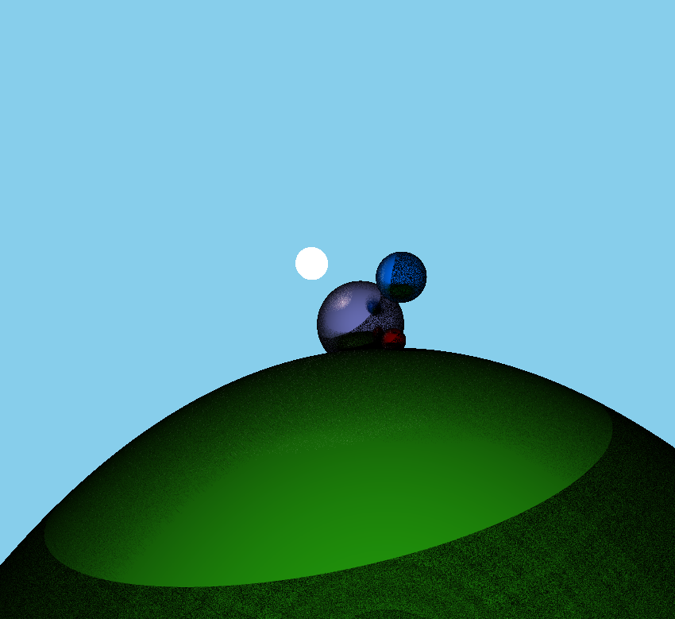
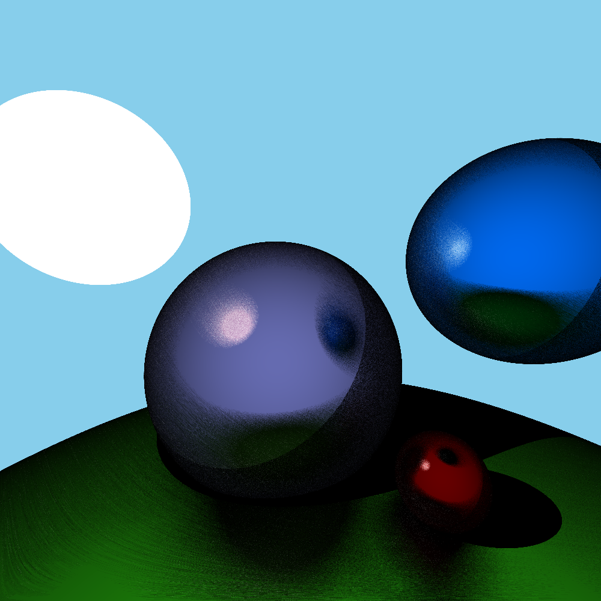
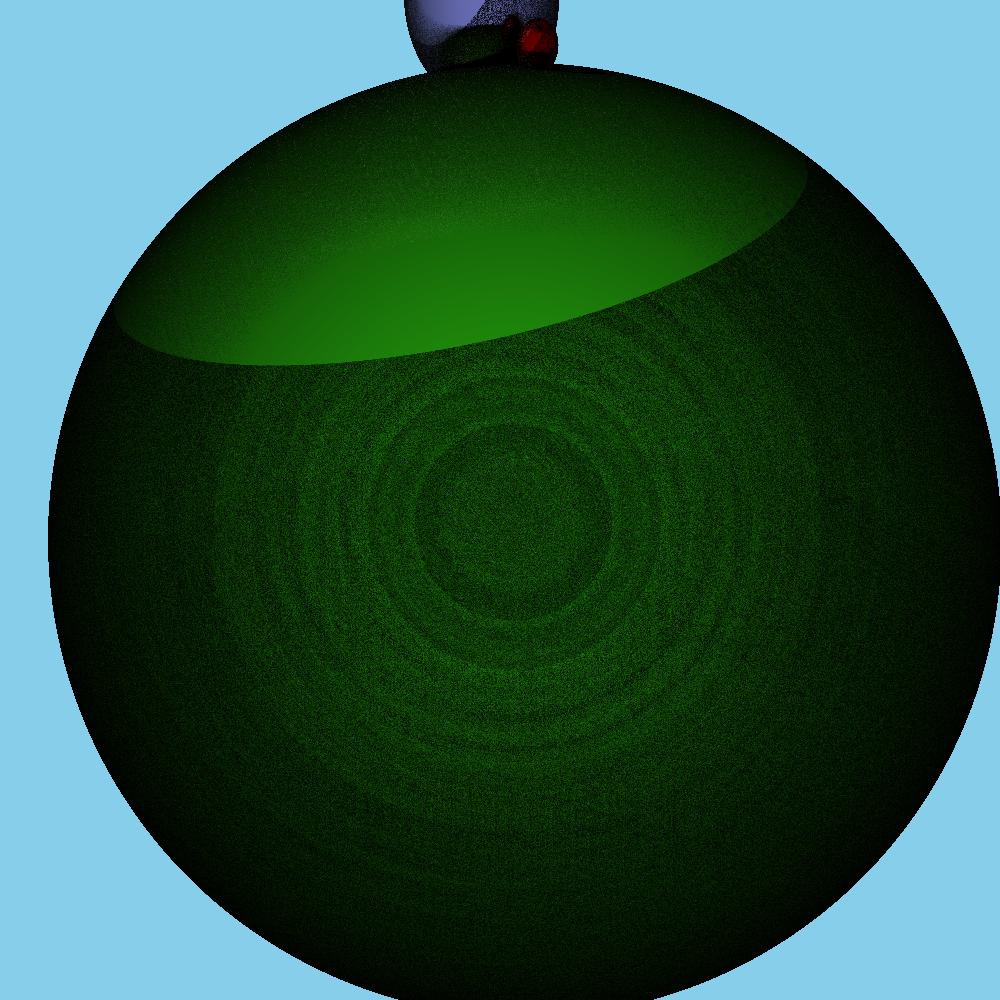
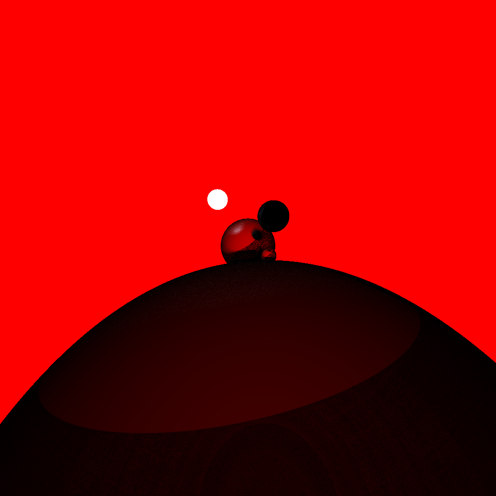
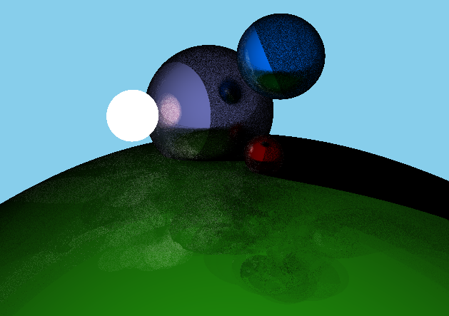

# Raytracer
Dieser Raytracer entsteht im Rahmen des Programmierpraktikums für das Modul Computergraphik an der Humboldt Universität zu Berlin. Zu Beginn der Übungsaufgaben haben wir mit der Programmierung eines Wrappers um die OpenGL-API begonnen und auch für diesen Raytracer verwendet. Daher gibt es Dateien die nicht im Projekt verwendet werden. Die interessanten Datein sind Raytracer/src/Main.cpp und Raytracer/res/shaders/fragmentshader.frag.

## Inhalte
- [Gruppenmitglieder](#Gruppenmitglieder)
- [Features](#Features)
- [Implementation](#Implementation)
- [Ergebnisse/Screenshots](#Ergebnisse/Screenshots)
- [Dependencies](#Dependencies)
- [Quellen](#Quellen)
- [Setup](#Setup)
- [Ausführung](#Ausführung)

  
## Gruppenmitglieder
Jasper Lennart Köhn (623385) <br>
Max Thomas Reinstadler (622083) <br>
Senol Schulz (624986)

## Features
- Bewegbare Kamera
- "Echtzeit" Raytracing für Kugeln mit
  - mehreren Rays pro Pixel ```u_RaysPerPixel```
  - mehreren bounces pro Ray ```u_MaxBounces```
- Beleuchtungsberechnung durch die lineare Interpolation zwischen einer spekularen und einer zufälligen diffusen Komponente anhand des Winkels zwischen Ray direction und der Normale am Schnittpunkt von Ray und Kugel
- Shadow rays für die Schattenberechnung

## Implementation
### Die C++ Seite
Unser Raytracer ist vollständig im Fragment Shader implementiert. Daher benutzen wir zwei Dreiecke als Canvas, auf den wir die berechnete Pixelfarbe zeichnen. Beim Ausführen des Programms wird die main-Methode in Main.cpp aufgerufen. Nach der Initialisierung von glfw und glew werden die Vertexpositionen für den Canvas gesetzt. Zudem werden Camera und Shader initialisiert und geladen. Zuletzt setzen wir noch Uniforms, die wir später im Fragment Shader verwenden, und starten die Renderloop. 

#### Die Kamera
Wir verwenden eine Kamera mit orthographischer Projektion, weil wir beim Testen festgestellt haben, dass unser Programm so besser aussieht. In der Nähe vom Koordinatenursprung gibt es Probleme mit der Steuerung der Kamera. Da die Kamera aber nicht der Fokus unseres Projektes ist, haben wir das so belassen.

### Der Fragment Shader
#### Structs
- Ray, mit Ray origin und direction
- Sphere, mit Mittelpunkt und Radius
- RayInfo, nützliche Daten aus der Schnittpunktberechnung von Ray und Sphere

#### main()
Der Vertex Shader setzt nur die Position der Vertices des Canvas. Im Fragment Shader wandeln wir ```gl_FragCoord``` in Screen Koordinaten um. Anschließend berechnen wir mit der Rotationsmatrix aus der Kameramatrix die Richtung, in die wir die Rays aussenden. Aus der ```gl_FragCoord```  und der Framezahl wird ein Seed für unsere Zufallszahlen generiert. Für jeden Ray den wir pro Pixel aussenden wird ein ```vec2``` von Zufallszahlen erzeugt, um die wir die Ray origin verschieben. Das führt dazu, dass zwei Rays, die wir für einen Pixel aussenden, verschiedene Laufbahnen haben und nicht zweimal den selben Pfad tracen. Am Ende addieren wir das Licht aller Rays nach der trace() Funktion und teilen das Ergebnis dann durch die Anzahl der Rays, um das Ergebnis in allen Komponenten wieder zwischen 0 und 1 zu skalieren. 

#### trace()
1. Wir berechnen den Schnittpunkt des Rays mit der nächsten Kugel. Falls es keinen gibt, returnen wir das Himmelblau multipliziert mit der Farbe des Rays. Dadurch beeinflusst die Farbe des Hintergrunds auch die Farbe der Kugeln (siehe [Roter Hintergrund](#Hintergrundfarbe)).
2. Wir senden einen Shadow Ray vom Schnittpunkt des Rays zur Lichtquelle. Falls dieser keine Lichtquelle trifft, returnen wir das von der getroffenen Kugel emittierte Licht. Das ist vec3(0, 0, 0) für alle Kugeln, die keine Lichtquellen sind. Wir returnen nicht einfach vec3(0, 0, 0), weil wir in Tests festgestellt haben, dass die Lichtquelle dadurch verauscht wird.
3. Falls der Ray eine Lichtquelle getroffen hat, stoppen wir das Tracing, um Reflexionen in der Lichtquelle zu vermeiden und returnen das von der Lichtquelle emittierte Licht multipliziert mit der vom Ray akkumulierten Farbe.
4. Wir berechnen die neue Ray origin und direction. Dazu berechnen wir eine specularDir und eine zufällige diffuseDir und abhängig vom Eingangswinkel des Rays zu der Oberflächennormalen interpolieren wir zwischen diffuseDir und specularDir. Bei kleinem Winkel verwenden wir die specularDir und bei großem Winkel die diffuseDir. Das resultiert in den Reflexionen auf den Kugeln.
5. Zum Schluss berechnen wir die neue Farbe. Diese setzt sich zusammen aus der bisher akkumulierten Farbe multipliziert mit der Farbe der getroffenen Kugel und einem Faktor basierend auf dem Winkel des Rays und der Oberflächennormalen der Kugel.
6. Falls die Anzahl der maximalen Bounces ```u_MaxBounces``` noch nicht erreicht ist, gehe zu 1.

#### raySphereIntersect()
Wir berechnen nur eine Schnittstelle von Ray und Kugel. Das führt dazu, dass Kugeln verschwinden, wenn wir die Kamera in einer Kugel platzieren. Das zusammen mit Floating Point Fehlern ist vermutlich auch der Grund dafür, dass unsere Schatten noch viele farbige Punkte haben (siehe [Noise](#Noise)). Wenn ein Punkt innerhalb einer Kugel liegt und wir den Shadow Ray casten, dann liegt der berechnete Schnittpunkt hinter der Ray origin. Also ist der Weg zum Licht nicht blockiert und der Pixel wird farbig eingezeichnet.

## Ergebnisse/Screenshots




#### Noise


#### Hintergrundfarbe


#### Bug
Wir wissen nicht warum dieser Bug entsteht, aber es passiert häufig beim raustabben.


## Dependencies
Der Raytracer wurde unter Windows 10 und 11 mit Visual Studio 2022 und für die x86 Architektur entwickelt.
Dabei haben wir *GLFW* und *GLEW* verwendet. Zusätzlich haben wir glm für Vector und Matrix Operationen und stb_image zum Laden von Texturen verwendet.
Die benötigten Datein sind in den *Dependencies*- und *src\vendor*-Folder enthalten und müssen nur noch richtig in das Projekt eingebunden werden (siehe [Setup](#Setup)).

## Quellen
Für die Erzeugung der Zufallszahlen für die Offsets der Ray origin und der Vektoren für die diffuse Reflexion:
- www.pcg-random.org und https://github.com/imneme/pcg-cpp
- www.shadertoy.com/view/XlGcRh
- https://stackoverflow.com/a/6178290
- https://math.stackexchange.com/a/1585996

Für die Kameramatrizen:
- https://www.opengl-tutorial.org/beginners-tutorials/tutorial-3-matrices

## Setup
Nach dem Öffnen der Solution sollte das Projekt direkt ausführbar sein, falls das nicht der Fall ist, stellen Sie sicher, dass Sie x86 verwenden und in den
*Solution Properties* die Folgenden Felder, wie beschrieben gesetzt sind:

(**C/C++ - General**) Setzen Sie *Additional Include Directories*:
- src\vendor
- src\Framework
- src\Framework\GLAPI
- $(SolutionDir)Dependencies\GLFW\include
- $(SolutionDir)Dependencies\GLEW\include

Zum Kopieren: <br>
`src\Framework\GLAPI;src\Framework;src\vendor;$(SolutionDir)Dependencies\GLFW\include;$(SolutionDir)Dependencies\GLEW\include`

(**Linker - General**) Setzen Sie *Additional Library Directories*:
- $(SolutionDir)Dependencies\GLFW\lib-vc2022
- $(SolutionDir)Dependencies\GLEW\lib\Release\Win32

Zum Kopieren: <br>
`$(SolutionDir)Dependencies\GLFW\lib-vc2022;$(SolutionDir)Dependencies\GLEW\lib\Release\Win32`

(**Linker - Input**) Setzen Sie *Additional Dependencies*:
- glfw3.lib
- opengl32.lib
- User32.lib
- Gdi32.lib
- Shell32.lib
- glew32s.lib

Zum Kopieren: <br>
`glfw3.lib;opengl32.lib;User32.lib;Gdi32.lib;Shell32.lib;glew32s.lib`

## Ausführung
Über Visual Studio (F5).
